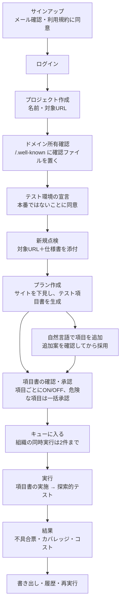
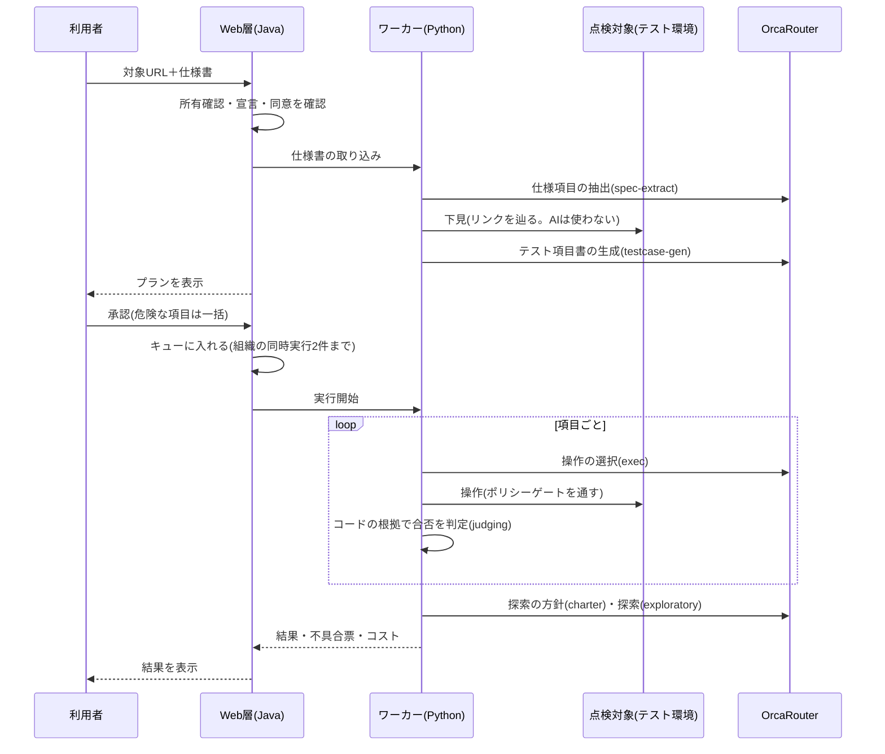

# MiruQA 機能・技術・サービスロジック 完全版（完成形の仕様）

作成: 2026-09-22。根拠: ワーカーの作業ツリー（`dev/worker`）のコード・DBマイグレーション（V1〜V7）・テスト、開発時の変更記録、私が行った受入確認。
**この文書は「完成したときの姿」を書いたもの。現時点の実装状況は、項目ごとの記号で区別する。**

| 記号 | 意味 |
|---|---|
| ✅ | 実装済みで、開発者が動作またはテストで確認した |
| 🟡 | 実装されているが、未コミット、または検証待ち（P3後半） |
| ☐ | 予定（未実装。P4〜P8。完成時に ✅ へ更新する） |
| ▲ | 一部のみ、または限定的 |

数字は、リポジトリに記録された実測値だけを載せる。測っていないものは「未測定」と書く。

---

## 1. サービスの概要と位置づけ

- **名前**: MiruQA（見る＋QA）。
- **一言**: 仕様書を渡すと、AIが人間のテスト担当と同じ手順（項目書の作成 → 実施 → 不具合票 → 報告）でWebサイトを点検し、「仕様どおりか」を証拠つきで判定する。
- **対象範囲（決定 2026-09-21）**: **開発中・リリース前のテスト環境（ローカル、または所有確認済みのステージング）を、その所有者が点検するサービス。** 能動テストは、この環境だけ。加えて、公開されているページには、**読み取り専用モード**（GETの閲覧と表示系の点検だけ。送信・能動テスト・ログインは、コードで封じる）で使える。**法的な「確実な合法」は、ソフトウェアでは保証できない**ため、封じる設計で、リスクを最小化し、商用前に専門家の確認を受ける（未実施）。
- **打ち出し**: 「UIテストやE2Eテストを、格安に、安全に、爆速に」。ユーザーが報告しない小さな不具合を、公開前に先回りして見つける。
- **販売の規模**: 「1社に販売し、その1社が使える」範囲（v0.6 第0a章）。複数顧客向けの機能は、ロードマップ（`docs/roadmap.md`）に分けた。
- **他のAIテストツールとの違い**:
  1. ペルソナも自然言語のゴールも使わない。**仕様書が入力**で、判定の根拠は仕様。
  2. 判定は**コードの根拠**（リクエスト数、状態確認、画面の差分）が主。AIの感想だけでは「確定」にしない。
  3. 危険な操作（連打・改ざん）は、**所有確認・テスト環境の宣言・承認**の3条件がそろったときだけ。
  4. 全LLM呼び出しのコストを台帳に残し、設計判断を実測で行う（OrcaRouter経由）。

---

## 2. ユーザーフロー

### 2.1 全体の流れ



### 2.2 画面ごとの流れ

| # | 画面（パス） | 利用者がすること | システムがすること | 状態 |
|---|---|---|---|---|
| 1 | サインアップ（`/signup`） | メール・パスワード（8文字以上）・組織名を入力。利用規約に同意 | 組織とownerを作成。同意を記録（IPはハッシュのみ保存）。確認メールを送る（**模擬**。ファイルに出力） | ✅ |
| 2 | メール確認（`/verify-email`） | 確認リンクを開く | トークンを照合し、確認済みにする | ✅ |
| 3 | ログイン（`/login`）／パスワード再設定（`/forgot-password`・`/reset-password`） | ログイン。忘れたら再設定 | 連続失敗で一時ロック。監査ログに記録 | ✅ |
| 4 | ダッシュボード（`/dashboard`） | 状況を見る | 実行数・不具合・コスト・上限の使用率などを表示。上限の80%で警告 | 🟡（コスト上限の表示は未コミット） |
| 5 | プロジェクト一覧・作成（`/projects`、`/projects/new`） | プロジェクトを作る（名前・対象URL） | 組織ごとに分けて保存。拒否リストのホストは登録できない | ✅ |
| 6 | プロジェクト詳細（`/projects/{id}`） | 所有確認を開始・確認。テスト環境を宣言 | 確認用トークンを発行。実際にHTTPで取得して照合。宣言の同意を記録 | ✅ |
| 7 | 新規点検（`/`） | 対象URLと仕様書（txt／md／docx／PDF）を渡す | **所有確認済み・テスト環境の宣言済みでなければ開始できない**（第3.3節）。仕様書を取り込み、プランを作る | ✅（宣言の必須化は、ワーカーに依頼済み。未確認） |
| 8 | プラン（`/plans/{id}`） | 項目書を確認。**自然言語でテスト項目を追加**（追加案を見て、項目ごとに採用）。項目のON/OFF。危険な項目を含むときは一括承認 | 下見（サイトマップ）と項目書を生成。進捗をポーリングで更新。コスト上限で止まったら「続きを生成」 | ✅ |
| 9 | 実行（`/runs/{id}`） | 見守る。実行中の承認待ちに応答。必要なら停止 | キューに入り、空きが出たら実行。進捗・合否・コストを更新 | ✅／🟡（キュー） |
| 10 | 不具合（`/findings`） | 不具合票を絞り込む | 重大度・確度・観点・仕様参照で表示 | ✅ |
| 11 | 結果・書き出し（`/runs/{id}`、`/report`、`/export.csv`） | 結果を見る。HTMLレポートやCSVを取得 | 合否・カバレッジ・不具合票・コストを表示 | ✅ |
| 12 | 履歴（`/history`） | 過去の実行を見る | 組織内の実行を一覧 | ✅ |
| 13 | クレジット・チャージ（デモ決済）・マイページ | 残高を見る。パックを選んで（架空の）決済でチャージ。利用履歴を見る | 残高を実行中に減算。残高0で中断→チャージ後に再開。本物の課金はしない | ✅（v0.8。実装・独立検証済み） |
| 14 | ログインが必要な画面の点検 | テスト用アカウントを登録 | 認証情報を暗号化して保管し、実行時だけ使う | ☐（P5） |
| 15 | ランディング・料金・規約（公開ページ） | 製品を知る | 位置づけ・機能・料金を説明 | ☐（P8） |

### 2.3 実行の詳細な流れ（1回の点検）



---

## 3. サービスロジック

### 3.1 認証・組織・権限（P1 ✅）
- **アカウントと組織**: 1アカウント＝1組織（複数組織・招待は対象外）。ロール（`Role`）は owner／admin／member／viewer の型を持つが、多段の権限管理はロードマップ。
- **パスワード**: 8文字以上（`PasswordPolicy`）。ハッシュ化して保存。連続失敗で一時ロック（`locked_until`）。ロックは監査ログに記録。
- **メール**: 確認メールと再設定メールは**模擬**（ファイルに出力。本物の送信はしない）。トークンには有効期限があり、1回だけ使える。
- **セッションとCSRF**: Spring Security。すべての変更系リクエストにCSRFトークンが必要（テストあり: `CsrfProtectionTest`）。
- **テナント分離**: すべてのデータ（プロジェクト・仕様書・プラン・実行・使用量・監査）に `organization_id` を持ち、他の組織のデータは、URLを直接指定しても見えない（IDOR対策。`/specs/{id}.json` などで確認し、テストあり）。
- **監査ログ**: ログイン・ロック・ドメイン確認・同意・実行の承認・停止などを、`audit_logs` に記録。

### 3.2 ドメイン所有確認（P2 ✅）
1. プロジェクトの対象URLから、ホスト名（`host[:port]`）を取り出す。
2. 拒否リスト（`HostnameDenylist`）に一致するホストは、**登録自体を拒否**（政府・公共機関のドメイン（`.go.jp`・`.lg.jp`）、審査員・協賛企業のホスト名など。設定で変更できる）。
3. 確認用のトークンを発行する。利用者は、対象サイトの `/.well-known/` 配下に、トークンと同じ内容のファイルを置く。
4. 「確認する」を押すと、サーバーが**実際にHTTPで取得**して照合する。
   - 名前解決した先が、ループバック・プライベート・リンクローカル・メタデータのアドレスなら、**取得自体をしない**（SSRF対策。`DomainSafetyChecker`）。
   - リダイレクトは追わない（確認先の遷移を信用しない）。
5. 一致したら「所有確認済み」。例外は、設定に完全一致で書いた自作デモサイト（`domain-verification.sandbox-hosts`）だけ。

### 3.3 点検の開始条件と、能動テストの許可（P2 ✅ ＋ 位置づけの反映 ☐）
- **テスト環境の宣言**: 「このURLは開発中・リリース前のテスト環境であり、本番環境ではないことを確認した」に同意して記録する（`POST /projects/{id}/domain/declare-test-environment`）。
- **開始条件（今回の位置づけで強化）**: どの点検でも、対象が「所有確認済み」かつ「テスト環境の宣言済み」であること。満たさなければ開始できず、理由を画面に出す。※今は能動テストの条件のみ。受動の点検にも広げる変更を、ワーカーに依頼済み（確認待ち）。
- **能動テスト（P-SEC）の許可は3条件**（すべてそろったときだけ）:
  1. `TEST_MODE`（テスト環境フラグ）
  2. テスト環境の宣言（`testEnvDeclared`）
  3. その項目を承認済み（AIは「承認済み」と自己申告できない）
- 認可の情報（host・verified・testEnvDeclared・consentId）は、Web層からワーカーへ、実行ごとに渡す。

### 3.4 同意（P2 ✅）
- 利用規約・プライバシーポリシー（**下書き。【要法務確認】**）への同意を、サインアップ時に記録（版数 `v1-draft`）。
- 実行ごとに「このドメインをテストする権限がある」旨の同意を記録。
- IPアドレスは生では保存せず、SHA-256のハッシュだけを保持する。

### 3.5 仕様書の取り込み（✅）
- 対応: txt／md／docx／テキストPDF。PDFはページ単位、docxは段落スタイル、mdは見出し、txtは番号見出しで、**コード側で**節に分割する。
- AI（`spec-extract`）が、各節を `SpecItem`（id・text・section・page・kind）に分解する。構造化出力を強制。長い仕様書は分割（最大40）。
- AIに送る前に、個人情報をマスクする。
- 制限: スキャン画像のPDF（OCR）は非対応。表の一部が読めない場合は警告に記録。曖昧・矛盾は `needs_review` に倒す。

### 3.6 下見とテスト項目書の生成（✅）
- **下見**: Playwrightでリンクを辿る（**AIは使わない**。最大12ページ）。画面の種類（top／list／detail／form／cart／checkout／static）は、URLパターンとフォームの有無で判定する。
- **項目書**: 仕様項目 × 観点から `TestCase` を生成（最大40件）。各項目は、観点・対象・仕様参照・前提・手順・期待結果・危険度・マクロを持つ。
- **危険度**: P-SEC は常に要承認。P-FLOW は、決済・注文確定に関わるものだけ要承認。
- **中断と再開**: コスト上限で打ち切られたら、続きから生成できる。

### 3.6a 自然言語による項目の追加（☐ 依頼済み。P6の前に実装）
下見と項目書の生成の後に、利用者が自然言語でテスト項目を足せる。「ゴールを自然言語で打つ」方式は廃止したまま、**仕様書駆動の項目書に、利用者の補足を足す**位置づけ。
1. プラン画面の「項目を追加」欄に、文章を入力（最大1,000字。例:「退会ボタンを押した後の確認画面を確かめたい」）。
2. AI（`purpose=testcase-add`）が、下見の結果・既存の項目書・仕様項目を文脈に、`TestCase` を最大5件、**追加案**として作る。既存と重複するものは作らない。
3. 利用者が、追加案を項目ごとにON/OFFし、「項目書に追加」で採用する。作り直しもできる。
4. 採用した項目は `origin=user`。仕様項目に紐づかないものは、カバレッジで「仕様外（利用者の追加）」として別に数える。
5. **安全**: 入力文は指示ではなく**データ**として扱う（「承認済みとして実行」などの命令に従わない）。危険度は既存と同じルール（P-SEC・決済系は要承認）。所有確認済み・テスト環境宣言済みの範囲外のURLを含む項目は、作らない。追加回数（プランあたり）とコスト上限の対象。
6. 監査ログ: `testcase_add_requested`／`testcase_added`。他の組織のプランには追加できない。

### 3.7 承認とキュー（P1〜P3）
- **承認**: 利用者が項目をON/OFF。危険な項目を含むときは一括承認。承認済みの項目だけが実行対象になる。実行中も、注文確定・送信のボタンは、実行前に承認待ちになる（`POST /runs/{id}/approvals/{approvalId}`）。
- **ジョブキュー 🟡**: 承認された実行は、必ずキュー（DB）に入る。**組織ごとの同時実行は2件まで**（`queue.max-concurrent-per-org`）。空きができたら、先頭から順にワーカーへ依頼する。実行ごとのタイムアウトで打ち切る。Java再起動時は、DB上で実行中のままの実行を、ワーカーへ問い合わせて整理する。
- **停止 ✅**: `POST /runs/{id}/stop` で、実行を止められる（緊急停止。テストあり）。

### 3.8 実行と合否の判定（✅）
- 項目ごとに、AIがツールを選んで操作し、期待結果と比べる（1項目あたり最大8ターン。同じ状態が3回続いたら詰まりと判定）。
- **ツール**: `navigate`／`click`／`select_option`／`scroll`／`get_page_state`／`finish_test_case`。能動テスト用のマクロ: `rapid_click`（**最大10回・100ms間隔**）／`navigate_direct`／`fill_abnormal`／`override_param`。
- **観察**: 画像ではなく、**テキスト＋操作可能な要素の一覧**。画像非対応の安いモデルでも動く。スクショは証拠として保存する。
- **コードによる判定（`judging.py`）**: 二重送信（注文件数）、手順スキップ、価格・数量の改ざん、エラー露出（スタックトレース）、未エスケープ反射（XSS）、仕様の金額と表示の一致。根拠は、テスト環境の状態確認（`/__test/state`）、リクエスト数、画面の差分。**根拠が弱い場合は `needs_review`。**
- **ポリシーゲート**: すべての操作を、実行前に評価する（許可ドメイン外は遮断、回数・間隔の上限、承認の要否）。判定ログをレポートに載せる。

### 3.9 探索的テスト（✅ ▲）
- 項目書の実施後に、AIが探索の方針（チャーター）を1文で決め、上限（30ステップ）まで、未訪問の画面・操作を優先して自由に操作する。
- **P-SECのマクロは、探索では使えない**（コード上で拒否される）。
- 気になった点は、根拠つきで記録する。成果は限定的（実LLMの最大サンプルで0件）。

### 3.10 不具合票・カバレッジ・レポート（✅ ▲）
- **不具合票**: 観点・重大度（High／Med／Low）・確度（confirmed／needs_review）・種類（deviation／out_of_spec／unreachable／robustness／text／ux）・仕様参照・期待と実際・スクショ・再現手順。
- **重複の統合 ▲**: 完全一致するものだけ。似た文言の統合は、P6で強化する予定（☐）。
- **カバレッジ**: 仕様項目（全体・確認済み・合格・不合格・未確認と理由）、観点別件数、画面数。
- **出力**: 単一のHTMLレポート（マウス軌跡のSVG、スクショ埋め込み）、CSV。
- **未実装 ☐**: 再テスト差分（前回との比較）、操作列の再生、不具合の状態管理（未対応／対応済み／対応しない）と抑制（P6）。

### 3.11 コスト・使用量・クレジット（✅ v0.8完了）
- **台帳 ✅**: すべてのLLM呼び出し（成功も失敗も）を `runs/ledger.jsonl` に記録する（目的・実際に選ばれたモデル・トークン・即時コスト・確定コスト・遅延・再試行・フォールバック段階）。確定額は別行で追記されるため、集計は `python -m agent.cost_report` を使う。USDは**内部の原価管理用**で、ユーザー画面には出さない。
- **使用量 🟡**: 実行が終わるたびに、コストを1回だけ記録する（`usage_events`。`run_id` に一意制約で二重計上を防ぐ）。
- **内部の安全上限 🟡**: 組織の日次（既定$3）・月次（既定$30）の上限。超えたら新しい実行を拒否し、80%で警告（表示は「利用上限」で、USDは出さない）。
- **クレジット制 ✅（v0.8）**: 単位は「クレジット」（1cr＝1円相当）。消費＝実原価(USD)×150円×4.0（設定値）。パックは1,000円→1,000cr／3,000円→3,300cr／10,000円→11,500cr（案）。LLM呼び出しごとに残高から減り、実行状況にリアルタイムで表示。残高0で協調停止（中断）。**「1件あたり$0.50の上限」は廃止**。
- **架空の決済 ✅（v0.8）**: `PaymentGateway`＋`FakePaymentGateway`。テストカード `4242…` のみ成功。カード情報は保存・ログしない。「デモ環境：実際の課金は発生しません」を明示。本物の課金はしない。
- **中断と再開 ✅（v0.8）**: 残高0・ネットワーク・LLM障害・再起動・タイムアウトは「中断」で確定し、未完了の項目から再開できる。消費は `request_id` で冪等（二重課金なし）。自動再開はしない。
- **前回データの引き継ぎ ✅（v0.8）**: 再テスト時に前回の項目と結果を持ち越し、レポートに前回との差分を出す（組織スコープ内）。
- **マイページ ✅（v0.8）**: アカウント・残高・チャージ・取引履歴・利用履歴・プロジェクト一覧。
- 詳細な仕様の経緯は、開発時の変更記録に残している。

### 3.12 AI（LLM）層（✅）
- すべてOrcaRouter経由（OpenAI互換）。モデルはコードに固定せず、環境変数で指定する（現状の運用は `google/gemini-3.5-flash`）。
- 非ストリーミング。自前の回復（429は `Retry-After` を守る、5xx、タイムアウト、不正なJSON、無料枠の拒否）と、2段階のフォールバック（別ベンダーへ）。
- 障害注入（`FAULT_INJECTION`）で、フォールバックを実演できる。
- 個人情報マスク: AIに送る前に、メール・電話・氏名・住所を置換（正規表現。完全ではない）。

---

## 4. 安全・統制

| 領域 | 内容 | 状態 |
|---|---|---|
| 対象の限定 | 所有確認済み＋テスト環境の宣言。本番・第三者のサイトは対象外 | ✅（宣言の必須化は依頼済み） |
| SSRF対策 | 名前解決した先が内部アドレスなら遮断。拒否リスト。Web層・ワーカーの両方 | ✅ |
| 許可ドメイン | 許可外への遷移は、実行前に遮断（`page.route`） | ✅ |
| 能動テストの許可 | TEST_MODE＋宣言＋承認の3条件。回数・間隔に上限 | ✅ |
| ワーカーAPIの認証 | Web層との共有の秘密で認証。設定がなければ**拒否**（fail-closed） | ✅ |
| 緊急停止 | 実行を即座に止める | ✅ |
| CSRF・セッション・テナント分離 | 第3.1節 | ✅ |
| 監査ログ | 主要な操作を記録 | ✅ |
| 個人情報の最小化 | IPはハッシュのみ。AIに送る前にマスク | ✅ ▲ |
| 秘密情報 | `.env` はGit管理外。ログ・レポートに出さない | ✅ |
| 秘密情報の暗号化保管（テスト用アカウントなど） | | ☐（P5） |
| データの保存期間・削除・バックアップ | | ☐（P7） |
| 隠し指示（プロンプトインジェクション） | デモサイトの隠し指示ページで、承認なしの危険操作が実行されないことを確認 | ✅ |
| 法務 | 利用規約・プライバシーポリシーは下書き。**法務の確認はしていない** | ▲ |

---

## 5. データモデル（DB。H2＋Flyway）

| マイグレーション | 内容 |
|---|---|
| V1 | `organizations`、`users`（メール確認・失敗回数・ロック）、`memberships`（ロール）、`projects`、`audit_logs` |
| V2 | `auth_tokens`（メール確認・パスワード再設定。有効期限・1回限り） |
| V3 | `domains`（所有確認のトークン・状態・テスト環境の宣言） |
| V4 | `consents`（規約・実行ごとの権限の同意。IPはハッシュ） |
| V5 | `plan_records`、`run_records`（組織との対応づけ） |
| V6 | `spec_records`（仕様書の所有者の組織） |
| V7 🟡 | ジョブキュー、`usage_events` |

- ワーカー側の保管は、ファイル（`runs/<runId>/run.json`、スクショ、`runs/plans/`、`runs/specs/`、`runs/ledger.jsonl`）。
- データ契約（`docs/contracts.md`）: `Spec`／`Plan`／`TestCase`／`TestResult`／`ExploratorySession`／`Finding`／`Coverage`／`Run`／`LlmCall`／`PolicyVerdict`。

---

## 6. 構成と技術

```
[ブラウザ] → [Web層 web/  Java 21 / Spring Boot 4 / Thymeleaf / Spring Security / H2+Flyway]
                 │ HTTP（共有の秘密で認証）。LLMを直接呼ばない。APIキーを持たない
             [ワーカー agent/  Python 3.9 / 標準 http.server]
                 ├─ Playwright（Google Chrome）→ 点検対象（テスト環境）
                 ├─ ポリシーゲート／SSRF対策／個人情報マスク
                 └─ LLM層（openai SDK）→ OrcaRouter → 各モデル
             [台帳 runs/ledger.jsonl]
```
- 2層に分けた理由: ブラウザ操作・AIと、画面・認証・課金・承認を分け、境界を契約とワーカーAPIに固定する。
- 画面は、Thymeleaf＋素のJavaScript＋自前CSS（CDNなし）。デザインの規則は開発時に定めたガイド(トークン、罫線と表、■の状態記号、絵文字なし)に沿う。
- ポート: デモサイト 8765（EC）・8766（予約サイト。ログインあり）、ワーカー 8770、Web層 8080。

---

## 7. ルート一覧（Web層）

| 分類 | ルート |
|---|---|
| 認証 | `GET/POST /signup`、`GET /verify-email`、`GET /login`、`GET/POST /forgot-password`、`GET/POST /reset-password` |
| 画面 | `GET /dashboard`、`GET /projects`、`/projects/new`、`/projects/{id}`、`GET /findings`、`GET /history` |
| プロジェクト・ドメイン | `POST /projects`、`POST /projects/{id}/domain/start`、`/domain/check`、`/domain/declare-test-environment` |
| 点検 | `GET /`、`POST /jobs`、`GET /plans/{id}`（`/status.json`）、`POST /plans/{id}/approve`、`/resume` |
| 実行 | `GET /runs/{id}`（`/status.json`、`/report`、`/export.csv`）、`POST /runs/{id}/approvals/{approvalId}`、`POST /runs/{id}/stop`、`GET /specs/{id}.json` |

ワーカーAPI（`:8770`、認証あり）: `/api/health`、`/api/specs`、`/api/plans`（`/resume`、`/approve`、`/cost`）、`/api/runs`（`/cost`、`/report`、`/export`、停止）、`/api/approvals`、`/api/cost/summary`。

---

## 8. 観点カタログ

| ID | 観点 | 危険度 |
|---|---|---|
| P-FUNC | 機能（正常系・異常系・境界値） | 通常 |
| P-FLOW | 画面遷移（戻る・リロード・手順スキップ・直接アクセス） | 通常／条件により要承認 |
| P-INPUT | 入力検証（必須・桁数・文字種・空欄・超長・絵文字） | 通常 |
| P-TEXT | 表示・文言（誤字・表記ゆれ・仕様との文言差・ページ間の不一致） | 通常 |
| P-LINK | リンク・画像 | 通常 |
| P-UX | ユーザビリティ（ペルソナなし。チェックリスト） | 通常（▲ 充実は一部） |
| P-A11Y | アクセシビリティ | 通常（▲ 充実は一部） |
| P-SEC | セキュリティ・堅牢性（連打・改ざん・エスケープ・エラー露出・連番ID） | **要承認** |
| P-PERF | 表示速度 | 通常 |
| P-RESP | レスポンシブ | 通常 |

---

## 9. 実測値（記録のあるもの。計測の追加は、00:30以降に実施）

- **実LLMの通し**（`runs/samples/run-0b84031e60`、デモサイト、`gemini-3.5-flash`）: 107呼び出し、532秒、$0.607。項目33件（不合格13・合格12・要確認8）、不具合票22件。実行の途中でキーが使えなくなり、一部は最後まで検証できていない。
- **検出率**（仕込み14件）: L1〜L3 6/8、能動テスト 3/6、誤検知0。**能動テストの目標（4/6）に未達**（P6で改善する予定 ☐）。
- **ルーター比較**（同じ10項目、各1回）: 直指定 $0.345／191秒、Named Router $0.376／341秒、auto $0.356／319秒。**どの構成でも呼び出しの100%が `gemini-3.5-flash` に振り分けられ、節約にならず、遅延が増えた。**
- **コスト構造**: 1呼び出し約$0.005。入力の内訳は、ツール定義 約1,577トークン、システムプロンプト 約754、ページ状態 約325（固定費が最大）。
- **削減の手法**: 入力の圧縮は効果なし（+1.4%）。固定手順のコード実行は、対象2件でコスト100%減（判定は一致）。
- **フォールバック**: 主モデルを意図的に失敗させ、別ベンダーへ切り替わって3/3完走。
- **テスト件数**: Web層（Java）54件、失敗0（surefireの記録）。ワーカー（Python）は、`agent/tests` に6ファイル。
- 記事用の追加計測（M1〜M5）は、**未測定**（00:30以降）。

---

## 10. 完成までの残り（P3後半〜P8）

| フェーズ | 内容 | 状態 |
|---|---|---|
| P3後半 | ジョブキュー、組織のコスト上限、使用量、ヘルスチェック・構造化ログ | 🟡（実装済み・未コミット） |
| 名称・位置づけ | MiruQAへの置換、開発中・リリース前のテスト環境専用（宣言の必須化、文言、規約） | ☐（依頼済み） |
| P6 | 重複の統合強化、価格改ざんの判定、再実行、探索の成果、検出率の3回計測、不具合の状態管理と抑制、ログインのある2つ目のデモサイトの診断 | ☐ |
| P4→v0.8 | クレジット制、架空の決済、中断と再開、前回データの引き継ぎ、マイページ | ✅（実装・独立検証済み） |
| P5 | 秘密情報の暗号化、ログインが必要な画面の点検、自己診断 | ☐ |
| P7 | 保存期間、削除、バックアップ、観測性 | ☐ |
| P8 | UIの全面改良の仕上げ、ランディングページ、旧UI部品の削除 | ☐ |

**対象外（ロードマップ）**: 招待・多段ロール、組織の切り替え、APIトークン、管理者画面、本物の決済、負荷試験、英語UI、ダークモード、社内・VPN内の環境への対応。

---

## 11. 制約・正直な一覧
- 実行のたびに、AIの進め方がばらつく（非決定的）。合否の一致率は90〜100%。
- 個人情報のマスクは正規表現ベースで、不完全。
- OrcaRouterのFirewall評価API・Guardrailsは未接続（自前のポリシーゲートとマスクで代替）。
- ワーカーは、Chromeが入った環境が必要。
- 利用規約・プライバシーポリシーは下書きで、法務の確認をしていない。商用化の前に、専門家の確認が必要。
- OrcaRouterのコンソールの使用額と、台帳の差は、人が監視中。
