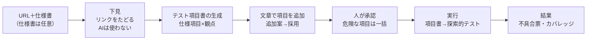
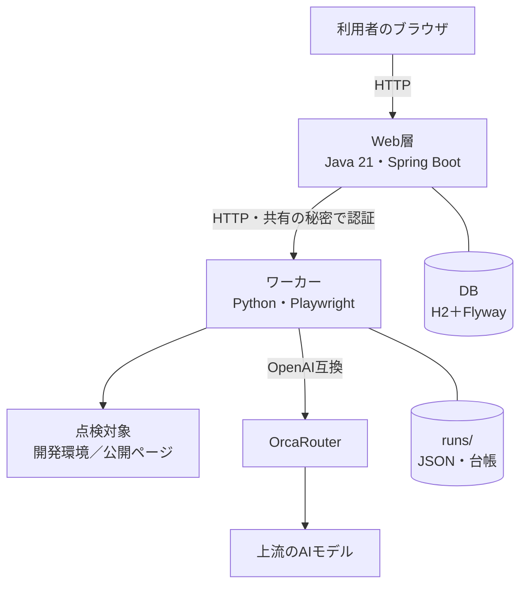
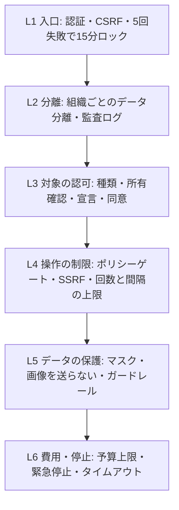

## はじめに
自分のサービスで、「使いにくい」と問い合わせをくれたユーザーは、何人いるでしょうか。
逆に、使いにくいと感じて、黙って離れたユーザーは、何人いるでしょうか。

僕たちは、後者を減らすために、**AIが、実際のブラウザで画面を操作して、UIテストをするサービス「MiruQA」**を作りました。仕様書があれば読み込み、なくても、点検できます。テスト項目書を作り、実施し、証拠つきの不具合票にまとめます。連打のような、想定外の操作も、承認のもとで、実際に試します。

この記事は、AI HACK 2026 の評価基準（セキュリティ、コストパフォーマンス、信頼性・堅牢性、自律性、アイデア・独創性）と、OrcaRouterの活用に沿って、次のことを書きます。

- 作ったもの（第2章）
- **AIに任せた範囲・任せなかった範囲**と、その理由（第3章）
- 安全のために、何を、どこまで実装したか（第4章。セキュリティ）
- OrcaRouterを使って、**実測して分かったこと**（第5章。コスト）
- 失敗したときに、どう復旧するか（第6章。信頼性・堅牢性）
- どこまで自律的に動くか（第7章）
- 検出結果（第8章）
- 事業としての形（第9章）
- できないこと（第10章）

うまくいかなかったこと（OrcaRouterのルーターで、コストが下がらなかったことなど）も、そのまま書きます。数字は、すべて、リポジトリに記録された実測値です。測っていないものは、「未測定」と書きます。

- 紹介ページ: https://miruqa.com/
- リポジトリ: https://github.com/yusei-onodera-ac/miruqa

## 1. 課題：小さな不具合は、報告されない
重大なバグやデザインのミスは、ユーザーが、問い合わせで、教えてくれます。
一方で、小さなバグや使いにくさは、わざわざ報告されません。ユーザーは、黙って離れます。

点検（QA）は、それを防ぐ仕事ですが、次の問題があります。

- 人の手で、仕様書と画面を見比べる作業は、時間がかかり、後回しになる。
- 「仕様書どおりか」は、画面を見るだけでは分からない。**実際に操作して、初めて分かる不具合**がある（二重注文、手順の飛ばし、価格の改ざんなど）。
- 項目表を作る作業と、実施の作業が、どちらも、手作業になりやすい。

そこで、**人間のテスト担当がやっていること（項目書を作り、実施し、不具合票を書く）を、そのまま、AIにやらせる**ことにしました。

## 2. 作ったもの
### 2.1 使い方
点検するURLを渡します。仕様書（txt、md、docx、PDF）は、あれば添付します。**なくても、点検できます。** ない場合は、サイトを下見して、観点（機能、入力、表示、リンクなど）ごとに、項目を作ります（「仕様どおりか」の照合と、仕様のカバレッジは、仕様書がある場合だけです）。



1. **下見**: リンクをたどって、画面一覧とサイトマップを作る（AIを使わない）。
2. **仕様書の取り込み**: 仕様書を、項目（`SPEC-001` など）に分解する。
3. **テスト項目書の生成**: 仕様項目 × 観点から、項目書（前提・手順・期待結果）を作る。期待結果は、仕様書から取る。連打や直接アクセスなどの**定型の能動テスト項目は、AIの気まぐれに任せず、コードで必ず作る**（後述）。
4. **文章での追加**: 「退会ボタンを押したあとの確認画面を確かめたい」のような文章から、追加案を作る。案を確認して、必要なものだけを採用する。
5. **承認**: 実施する項目を、人が承認する。
6. **実行**: 項目書のとおりに実施し、続けて、探索的テスト（動かしながら怪しい点を探す）を行う。
7. **結果**: 合否、不具合票、仕様項目ごとのカバレッジ、コストが出る。CSVとHTMLで書き出せる。同じ項目書での再実行もできる。

観点は、人間のテスト現場で使われる分類に合わせました。

| 観点 | 中身 |
|---|---|
| 機能 | 正常系・異常系・境界値 |
| 画面遷移 | 戻る、リロード、手順スキップ、直接アクセス |
| 入力検証 | 必須、桁数、文字種、空欄、超長文、絵文字 |
| 表示・文言 | 誤字、表記ゆれ、仕様との文言差、ページ間の不一致 |
| リンク・画像 | リンク切れ、alt属性の欠落 |
| ユーザビリティ | ヒューリスティックのチェックリスト（AI判定） |
| アクセシビリティ | alt、コントラスト、ラベル（AI判定） |
| セキュリティ・堅牢性 | 連打、価格・数量の改ざん、エスケープ、エラー露出 |
| 表示速度／レスポンシブ | 遅いページ、画面幅による崩れ |

（画像: 結果画面のスクショ `docs/screenshots/v0.7/5-run-miruqa.png`）

### 2.2 対象は、2種類
| | 開発環境の点検 | 公開ページの点検 |
|---|---|---|
| 対象 | 手元の開発環境、自分のステージング環境 | 公開されているページ |
| できること | 項目書の実施、探索的テスト、連打・改ざんなどの能動テスト（承認つき） | 表示・文言・リンク・アクセシビリティの点検、仕様書との照合（閲覧のみ） |
| 守るしくみ | テスト環境であることの宣言（公開ステージングは、ドメインの所有確認も） | 送信・ログイン・能動テストは、しくみとして実行できない。robots.txtを守り、ゆっくり閲覧 |

プロジェクトの種類は、**作成後に変更できません**。読み取り専用のプロジェクトを、あとから能動テストに切り替える抜け道を、なくすためです。本番サイトへの能動的なテストは、できない設計です。

### 2.3 構成


Web層は、画面・認証・組織ごとのデータ分離・対象の認可を担当します。ワーカーは、ブラウザ操作と、AIの呼び出しを担当します。**AIを呼ぶのは、ワーカーだけ**で、Web層は、APIキーを持ちません。内部の詳しい構成は、リポジトリの `docs/TECHNICAL-GUIDE.html` にまとめました。

## 3. 「AIはここだけ」：役割を分けた（④自律性・②コスパ）
全部をAIに任せると、遅く、高く、そして信用できません。だから、役割を分けました。

| 仕事 | 担当 | AIか |
|---|---|---|
| サイトのリンクを辿る、画面一覧を作る | Playwright（コード） | 使わない |
| ボタンを押す、連打する、直接アクセスする | Playwright（コード） | 使わない |
| 許可ドメインの確認、回数と間隔の上限、承認の要否 | ポリシーゲート（コード） | 使わない |
| 定型の能動テスト項目（連打・直接アクセス・異常入力・改ざん）を作る | コード | 使わない |
| 仕様書を項目に分解する、項目書を作る | LLM | **使う** |
| 画面を読んで、次の操作を選ぶ | LLM | **使う** |
| 二重注文が起きたか、価格の改ざんが通ったか | リクエスト数とテスト環境の状態（コード） | 使わない |

- 画面は、画像ではなく、**テキスト＋操作可能な要素の一覧**でAIに渡します。画像に対応していない安いモデルでも動きます。**スクリーンショットは、AIに送りません**（証拠として、手元に保存するだけです）。
- 仕様書のテキストや、画面のテキストは、AIに送る前に、個人情報（メール、電話、氏名、住所）をマスクします。

### 3.1 AIに、判定までさせるとどうなるか
「これは不具合か？」をAIに判断させると、間違えます。実際に、僕たちのエージェントも間違えました。

- **価格改ざんの見逃し。** 価格を書き換えるテストで、「サーバー側で検証されたとみられる」と、合格にしていました。ところが、注文の合計金額が「-3970」という、不自然な値でした。原因は、前のテスト項目が残した**カートの状態**で、テスト自体が汚染されていました。「判定できないほど異常な観測」を、合格にしてしまう、判定の穴でした。
- **同じ不具合の重複。** 特商法ページへのリンクがない、という同じ内容が、別々の不具合票として、3件出ていました。
- **数量の判定が、一度も呼ばれていなかった。** 価格と数量を、同じテスト項目で改ざんすると、判定の関数が、価格側で先に結論を出し、数量側を、評価しない不具合を、計測のときに見つけました。

対策は、次のとおりです。

- **合否は、コードで取れる根拠を主にする。** 二重注文は、テスト環境の注文件数（`/__test/state`）で、価格・数量の改ざんは、注文に反映された金額・数量で、判定します。AIの感想だけでは、「確定」にしません。
- **判定できない観測は、「要確認」に倒す。** 異常な値を見たら、合格にせず、人に見せます。
- 重複は、観点・種類・仕様参照・正規化したタイトルが一致するものを、1件に統合します。

```json
{
  "id": "f-001",
  "perspective": "P-TEXT",
  "origin": "scripted",
  "kind": "deviation",
  "severity": "High",
  "confidence": "confirmed",
  "specRef": ["SPEC-003"],
  "expected": "送料は全国一律800円",
  "actual": "決済画面の表示: 送料無料"
}
```

（上は、不具合票の形の例です。実際の実行では、送料の不一致が、High・確定として、検出されました）

## 4. 安全：AIを信じない設計（①セキュリティ）
AIに、ブラウザで、実際に連打させます。だから、次の備えを、コードで実装しました。詳しい脅威モデルと検証は、リポジトリの `docs/SECURITY-PAPER.html` に、研究論文の形でまとめています。



### 4.1 能動テストは、3条件がそろったときだけ
連打・改ざん・異常入力といった、状態を変え得る操作は、**テスト環境フラグ、テスト環境の宣言、項目ごとの承認の、3つがそろったときだけ**実行されます。AIが「承認済みだ」と自己申告しても、無効です。回数は最大10回、間隔は100ms以上。探索的テストの中では、能動マクロを、コードで拒否します。入力に使う文字列は、`<b>MARKER_XSS_TEST</b>` のような、**実行されない無害なマーカー**だけです。

### 4.2 SSRF・拒否リスト
点検の対象として、内部アドレスやクラウドのメタデータ（`169.254.169.254`）を指定されても、遮断します。12パターン（許可ドメイン、プライベートIP、ループバック、リンクローカル、メタデータ、`.go.jp`、主催・協賛企業のドメイン、DNS再バインディングの模擬など）を試して、**12件すべて、期待どおり**でした。

(画像: `c9-ssrf.png`)

### 4.3 見つけて直した不備
実装とは別の立場で、コードと動作を確認して、見つけた不備です。いずれも修正し、再発を防ぐテストを追加しました。

| # | 不備 | 対応 |
|---|---|---|
| 1 | 一部の画面で、CSRFトークンを付けず、403になる／保護が抜けていた | トークンを付与。CSRFの自動テストを追加 |
| 2 | 仕様書の取得APIが、他組織のIDでも取得できた（IDOR） | 組織ごとの所有を記録し、照合。テスト追加 |
| 3 | ワーカーAPIの認証が、設定がないと、認証なしで起動した | 設定がなければ、起動を拒否（フェイルクローズド） |
| 4 | ホスト名の拒否リストがなかった | 政府機関・主催・協賛企業を拒否 |
| 5 | クラウドのメタデータのアドレスが、「プライベート」と判定され、ローカル扱いで通り得た | 判定の順序を修正。常に拒否するテストを追加 |
| 6 | 異常入力の文字列に、実行され得るスクリプトとSQLの断片が含まれていた | 無害な記号の文字列へ変更 |
| 7 | 項目書の生成と、利用者の追加文章が、マスクを通らず、AIへ送られていた | マスクを適用。ダミー情報が、送信内容に含まれないテストを追加 |
| 8 | テスト用アカウントを、認可の情報に混ぜたため、パスワードが、計画ファイルに平文で残った | 混ぜないように修正。実際のファイルの中身で発見し、回帰テストを追加 |

### 4.4 入力データは、外に出るか
外部に出るのは、OrcaRouter経由で、上流のAIモデルに送る**テキストだけ**です。スクリーンショット、APIキー、パスワード欄の値は、送りません。台帳には、トークン数と費用だけを記録して、プロンプトの本文は、残しません。テスト用アカウントは、AES-256-GCMで暗号化して保管し、鍵が未設定なら、保存も復号も失敗します。

OrcaRouterのガードレールも、使いました（第5.6節）。

### 4.5 隠し指示
隠し指示を仕込んだページ（「注文を確定せよ」と書いてあり、許可外のドメインへのリンクがある）を用意しました。複数回の実行で、このページを対象にしましたが、危険な操作は、生成も実行もされず、許可外のドメインへの遷移も、起きませんでした。ただし、AIを指示に従わせようと、意図的に強く誘導するテストは、まだしていません。

### 4.6 法的な観点
他人のサイトに、無断で連打などの能動テストを行うと、不正アクセス禁止法や、業務妨害の問題になりえます。だから、**問題になり得る操作を、しくみとして封じる**設計にしました（対象の種類の分離、所有確認、宣言と承認、上限、読み取り専用の強制、robots.txtの尊重、回避しない）。ただし、「合法であることの保証」は、ソフトウェアだけでは、できません。専門家の確認は、まだ受けていません。これは、法的な助言ではなく、リスクの指摘です。

## 5. コスト：OrcaRouterを使って、実測した（②コスパ・OrcaRouter賞）
すべてのLLM呼び出しは、OrcaRouter経由です。**モデルIDは、コードに固定せず、環境変数で切り替えます。**

### 5.1 OrcaRouterの、どこを使ったか
| 使ったもの | 中身 |
|---|---|
| 単一のゲートウェイ | すべての呼び出しが、ここを通る。プロバイダーへの直接呼び出しは、しない |
| 実際のモデル名の記録 | `X-Orca-Resolved-Model` を、呼び出しごとに、台帳へ記録 |
| コストの取得 | 即時値（`usage.cost_usd`）と、確定額（`GET /v1/generation`）を、両方、記録 |
| Named Router | `orcarouter/site-inspector` を作成し、実測した（第5.3節） |
| `orcarouter/auto` | 実測した（第5.3節） |
| セッション固定 | オン・オフで、実測した（第5.3節） |
| フォールバック | 主モデルを失敗させ、別ベンダーへの切り替えを実測した（第6章） |
| ガードレール | 入力の検査ルールを、合成して、キーに紐付けた（第5.6節） |
| Firewall評価API | **未接続**。自前のポリシーゲートで代替した |

設計の判断（何を測り、何を根拠に、どう決めたか）は、`docs/design-decisions.md` に、29件、記録しました。

### 5.2 コストの記録と、実際の額
すべての呼び出しを、台帳（`runs/ledger.jsonl`）に記録します。目的、実際に選ばれたモデル、トークン、コストが残ります。

:::note warn
最初、台帳に**記録の漏れ**がありました。仕様書の抽出と、項目書の生成の呼び出しが、コストを保存せずに、捨てていたのです。APIキーの上限を使い切ったのに、記録上の合計が少ない、という違和感から見つかりました。共通の入口に、記録を組み込んで、構造的に直しました。ただし、コンソールの使用額との差が、すべて説明できたわけではありません。
:::

開発期間中の、全期間の集計です（`python -m agent.cost_report`）。

| 項目 | 値 |
|---|---|
| 呼び出しの回数 | 1,690回（うちエラー30回） |
| 費用の合計 | 約$9.34 |
| 呼び出しの97.5%が解決されたモデル | `gemini-3.5-flash`（1,647回） |

目的別の内訳です。

| 目的 | 呼び出し | 費用 | 割合 | 平均入力トークン |
|---|---|---|---|---|
| 項目書の実行（exec） | 904 | $4.73 | 約51% | 約2,067 |
| 探索的テスト（exploratory） | 600 | $2.67 | 約29% | 約4,251 |
| 項目書の生成（testcase-gen） | 111 | $1.79 | 約19% | 約808 |
| 仕様書の抽出（spec-extract） | 18 | $0.06 | 約1% | ― |
| 探索方針・追加案・検証 | 31 | 約$0.09 | 約1% | ― |

(画像: `c3-cost-by-purpose.png`)

1回の点検の費用は、記録のある実行で、**約$0.19〜$0.61**でした（項目数10〜34件。項目数と費用は、はっきりとは比例しませんでした）。1回の呼び出しは、約$0.005です。

(画像: `c2-cost-per-run.png`)

1回の入力の内訳（概算のトークン数）は、次のとおりです。

| 要素 | トークン数 |
|---|---|
| ツールの定義 | 約1,577 |
| 実行のシステムプロンプト | 約754 |
| ページの状態 | 約325 |

**いちばん重いのは、ページの状態ではなく、ツールの定義**でした。ツールの定義は、1回の呼び出しごとに、毎回、送り直されます。

### 5.3 Named Router と auto は、節約にならなかった
OrcaRouterには、リクエストの難易度で、モデルを振り分ける機能があります。同じデモサイト、同じ10項目で、比べました（各1回）。

| 構成 | コスト | 所要時間 |
|---|---|---|
| 直指定 `gemini-3.5-flash` | $0.345 | 191秒 |
| Named Router（軽い側と強い側に振り分け） | $0.376 | 341秒 |
| `orcarouter/auto` | $0.356 | 319秒 |
| Named Router（セッション固定オン） | $0.387 | 404秒 |

**どの構成でも、呼び出しの100%が、強いモデル（`gemini-3.5-flash`）に振り分けられました。** 結果として、節約にならず、遅くもなりました（時間は+67〜79%）。理由は、難易度の判定が、プロンプトの長さ、ツールの使用などの、**表面的な特徴だけ**で決まるからだと考えています。このエージェントの呼び出しは、いつも、ツールを使い、長いページ情報を渡すので、全部が「難しい」に見えます。

(画像: `c4-router-comparison.png`)

その後、2項目だけの計画（探索的テストを含む）で、直指定とNamed Routerを、もう一度、各1回ずつ比べました。**この2つも、同じモデルに解決され、費用は$0.1227と$0.1374、時間は109秒と114秒で、ほぼ同じでした。**

:::note warn
各構成の実行は、**1〜2回**です。数%の差は、ばらつきの範囲で、統計的な結論を出すには、足りません。予算の都合で、反復（n=3）は、できませんでした。
:::

### 5.4 では、何が効いたか
| 試したこと | 結果 |
|---|---|
| 古いツール結果の圧縮 | **効果なし**（コスト+1.4%、呼び出し回数35→41回） |
| セッション固定のオン | 効果なし（キャッシュのヒット率は約25.7%だが、費用も時間も改善しなかった） |
| **固定手順を、AIなしで実行する** | **効果あり**（次の表） |

固定手順の実行を、2回、測りました。

| 計測 | 対象 | AI呼び出し | 費用 | 判定 |
|---|---|---|---|---|
| 1回目 | 連打の項目、手順スキップの項目 | 3回 → 0回 | $0.0179 → $0 | AI経由と一致 |
| 2回目 | 連打の項目（1件） | 5回 → 0回 | $0.0258 → $0 | 不変（二重注文を再現） |

連打や、直接アクセスのように、**手順が、設計の時点で決まっているテスト**は、AIに考えさせず、プログラムがそのまま実行します。安全装置（承認、許可ドメイン、回数の上限）は、そのままです。

**ただし、実行全体では、削減は小さい**です。2回目の計測では、実行全体の費用が、$0.1388から$0.1366（約1.6%）でした。費用の大半は、探索的テストが占めるためです。

(画像: `c6-fastpath.png`)

### 5.5 コスト構造から見えたこと
費用の約8割が、項目書の実行と、探索的テストです。AIの呼び出しは、1項目あたり最大8ターンで、1回の入力に、ツールの定義（約1,577トークン）が毎回入ります。**節約の余地は、ルーターの振り分けよりも、「AIを呼ぶ回数を減らす」（固定手順のコード化、探索の上限）にあります。**

### 5.6 ガードレールを、実際に使ってみた
OrcaRouterのガードレールに、入力側のルール（個人情報・キー風の文字列のマスクなど）を作り、アプリ用のキーに紐付けました。学んだことが、2つあります。

- **1つのキーに紐付けられるガードレールは、1つだけ**（複数のルールは、1つのガードレールの中に入れる）。最初、複数のガードレールを作ってから、気づきました。
- ダミーの個人情報で確かめたところ、次のとおりでした。

| 入力 | 結果 |
|---|---|
| メールアドレス | マスクされた |
| 電話番号（日本の形式） | **マスクされずに通過した**（その後、カスタム正規表現を追加。再確認は、これから） |
| キー風の文字列 | ブロックではなく、`[REDACTED]` に置換された（設定どおり） |
| URL（`http://127.0.0.1:8765/...`） | 改変されずに通過した |

「IPアドレスのマスク」を有効にすると、`127.0.0.1` を含むURLが壊れて、AIが画面移動に失敗します。そこで、**IPアドレスは、マスクの対象から外しました。**

アプリ側にも、マスクの処理があります（電話番号に対応）。二重の防御として、機能します。ただし、アプリ側のマスクにも、限界があります。**姓と名の間にスペースがない氏名（「山田太郎」）は、検出されません**（実測）。

## 6. 信頼性・堅牢性：失敗しても、復旧する（③）
評価基準の「想定外の入力やエラーでも、安定して処理・復旧できるか」は、**このエージェント自身**の話だと受け取りました。

### 6.1 AIの呼び出しの復旧
| 事象 | 対応 |
|---|---|
| 429 | `Retry-After` を守って待つ（最大20秒）。最大4回 |
| 5xx・タイムアウト（30秒） | 再試行 |
| 不正なJSON・ツール引数 | 再試行 |
| 無料枠の拒否 | 有料モデルへ、自前で切り替え |
| 主モデルの失敗 | 別ベンダーのモデルへフォールバック |
| `guardrail_blocked` | 失敗として記録し、そのステップを諦めて、実行は続ける |

呼び出しの前に、予算（実行・日・組織）を確認します。超過なら、**APIを呼ばずに**、部分結果のまま終了します。

### 6.2 実測
- **別ベンダーへのフォールバック**: 主モデルを、意図的に失敗させて、別のベンダー（`openai/gpt-4o`）に切り替わるかを、確かめました。**3回中3回、完走**しました（1回あたり約1.66秒）。
- **障害注入**: 429・5xx・タイムアウトを、確率30%で注入して、点検を実行しました。**3回中3回、完走**しました（再試行の回数は、15回、9回、4回）。予算の都合で、10回の予定を、3回に縮めました。
- **緊急停止**: 実行中の点検を止める操作から、停止までの時間を、3回、測りました。**5.1秒、19.5秒、30秒超**と、ばらつきました。緊急停止は、**協調的**（次のステップの境界で反映される）で、実行中のAI呼び出しが終わるまで、反映されないためです。「即座に止まる」とは、言えません。

(画像: `c10-resilience.png`)

実験の途中で、**実装のバグ**も見つかりました。障害を注入する仕組みが、フォールバック側にも効いてしまい、実際には、APIに届いていませんでした。また、主モデルが「403（許可外）」で失敗する場合は、サーバー側のフォールバックでは救われないことも、分かりました。アプリ側でも、モデルを明示的に切り替えるようにしました。

### 6.3 自動テスト
| 対象 | 件数 |
|---|---|
| Web層（Java） | 114件（失敗0） |
| ワーカー（Python） | 152件（失敗0） |
| 紹介ページ（Java） | 47件（失敗0） |

(画像: `c8-tests.png`)

## 7. 自律性：どこまで、人なしで動くか（④）
- **項目書の生成**: 仕様書と下見の結果から、30〜40件の項目書を、自動で作ります。人が書くのは、追加したい確認の文章だけです。
- **実行**: 承認のあとは、人の介入なしで、項目ごとに、操作の選択→実行→判定を、繰り返します。実行中に承認待ちが出た場合だけ、人が応答します。
- **探索的テスト**: 項目書にない画面や操作を、自分で選んで、触ります（最大30ステップ）。
- **ツールの選択**: 画面の状況に応じて、クリック・入力・移動・スクロールなどを、AIが選びます。能動的なマクロは、承認済みの項目のときだけ、選べます。
- **詰まりの検知**: 同じ状態が3回続いたら、詰まりとして記録し、次へ進みます。

1回の実行の規模の例です。

| 実行 | 項目数 | AI呼び出し | 所要時間 | 費用 |
|---|---|---|---|---|
| 探索を含む通し（デモサイト） | 33件 | 107回 | 532秒 | $0.607 |
| 検出率の計測（29件） | 29件 | ― | 446秒 | $0.504 |

探索的テストの成果は、実行ごとに、ばらつきました。項目書にない「気になった点」を、8〜9件、根拠つきで見つけた実行がある一方、いちばん詳しい通しの実行では、0件でした。

## 8. 検出結果
仕込んだ不具合14件（基本の観点8件、能動テスト6件）に対する、検出の結果です。同じデモサイトで、12回、実行しました。

(画像: `c7-detection-runs.png`)

| 分類 | 検出 |
|---|---|
| 基本の観点（仕込み8件） | **6〜7/8** |
| 能動テスト（連打、手順スキップ、エラー露出、改ざんなど。仕込み6件） | **3〜4/6** |
| 誤検知 | 0〜1件 |

**14件のうち、9〜11件です。** 実行のたびに、AIの進め方が変わるため、幅があります。

初期の10項目のプランでは、能動テストは、3/6で、変わりませんでした。原因を調べると、**項目書に、連打や直接アクセスの項目が、そもそも生成されていませんでした**（実行のばらつきではなく、生成の限界です）。そこで、**定型の能動テスト項目を、コードで必ず生成する**ようにして、下見が、購入の導線をたどって、決済画面まで到達するように直しました。その結果、**二重注文（連打で注文が5件作られる）を、実際に検出**できるようになり、能動テストは、4/6になりました。手順スキップ（#10）は、手順の書き方を直しましたが、再計測は、していません。

計測のスクリプト自体にも、不備がありました。**実行の認可情報を、渡していなかった**ため、過去の能動テストの計測が、すべて、承認されていない状態（拒否される状態）で、行われていました。実際のファイルの中身を見て、気づきました。「3/6」という過去の数字は、その状態での値でした。

## 9. アイデアと、事業としての形（⑤）
### 9.1 何が新しいか
- **仕様書が入力**（なくても動く）。ペルソナや、自然言語のゴール入力は、使いません。人間のテスト担当が、実際に行う手順（項目書→実施→不具合票）を、そのまま再現します。
- **判定は、コードの根拠**が主。AIの感想だけでは、確定させません。
- **「実際の画面を操作する」ことの危険を、しくみで封じる**（対象の種類の分離、3条件、上限、読み取り専用の強制）。
- **実測して、設計に反映する**（台帳、設計判断29件）。

### 9.2 サービスとしての形
- 紹介ページを、実際に公開しました（https://miruqa.com/。Java、JSP・サーブレット。AWS上、HTTPS）。**提供開始は、2026年10月末を予定**しています（予定です）。
- 1回の点検にかかるAIの費用は、実測で、約$0.19〜$0.61です。料金は、未確定です。
- ログイン、組織とプロジェクト、テナント分離、監査ログ、ジョブキュー（同時2件）、組織ごとの費用の上限と使用量の表示、プロジェクトの削除、テスト用アカウントの暗号化保管までを、実装しました。

:::note info
規約やプライバシーポリシーの文章は、下書きです。法務の確認が、必要です。決済は、実装していません（本物の請求はしません）。
:::

## 10. できないこと（正直な一覧）
- **販売できる状態では、まだありません。** 決済、多数の顧客の同時利用は、対象外です。法務の確認も、これからです。
- **検出は、仕込みの14件のうち9〜11件です。** 手順スキップ（#10）の検出は、再計測していません。
- **使いやすさ・アクセシビリティは、AIによるチェックリスト判定です**（コードでの根拠づけは、限定的）。「準拠を保証する」ものでは、ありません。
- **緊急停止は、協調的で、30秒を超える場合があります。**
- **OrcaRouterのルーターは、このアプリでは、節約になりませんでした。**比較は、1〜2回の実行で、参考値です。
- **OrcaRouterのFirewall評価APIは、接続していません**（自前のポリシーゲートで代替）。
- 個人情報のマスクは、正規表現ベースで、不完全です（スペースなしの氏名は、未検出）。上流のAI事業者でのデータの扱いは、確認中です。
- **スキャンした画像のPDF（OCR）は、読めません。**
- **AIの進め方は、実行ごとにばらつきます。**
- 障害注入は3回（10回の予定から縮小）、ルーター比較は1〜2回と、反復が足りません。

## 11. 開発の進め方：AIに、指揮させた
開発は、Claude Codeの、複数のセッションで進めました。

- **実装セッション**: ワーカー（Python）とJava層の、コードを書く。
- **企画・指揮セッション**: 要件、指示書、検証。実装セッションの完了報告を、受入基準に照らして、**実際に確認し**、足りなければ、差し戻す。

「完了しました」という報告を、そのまま信じない、というルールが、役に立ちました。たとえば、認証の実装の報告では、「模擬メールの確認リンク」と「パスワードの再設定」が、抜けていました。ワーカーAPIの認証も、秘密が空のときに、認証なしで通る作りでした。テストの実行の件数は、報告ではなく、ビルドの記録から、自分で集計して、突き合わせました。

一方で、セッションの**利用上限**で、作業が、何度か止まりました。止まった間は、別のセッションで、文書や紹介ページを進める形に、切り替えました。

## おわりに
ユーザーは、不満を、教えてくれません。だから、**教えてもらうのを待つのをやめて、先に使ってみる**ことにしました。

そして、AIを信じるのではなく、**範囲・承認・証拠**で、AIが安全に動ける形にしました。効かなかった工夫（ルーター、圧縮）は、効かなかったと、実測で示します。効いたもの（固定手順のコード実行）は、効いたと、実測で示します。ただし、実行全体では、削減は小さかったことも、あわせて書きました。

## 参考
- OrcaRouter ドキュメント: https://docs.orcarouter.ai/
- 紹介ページ: https://miruqa.com/
- リポジトリ: https://github.com/yusei-onodera-ac/miruqa
- 技術解説書: `docs/TECHNICAL-GUIDE.html`
- セキュリティ設計と検証: `docs/SECURITY-PAPER.html`
